# Dokumentasi Website Sistem Informasi Nilai

## 1. Deskripsi Singkat
Website ini dibuat sebagai sarana pencatatan, pengelolaan, dan penampilan nilai mahasiswa.
Mendukung autentikasi dan akses terpisah untuk dosen, mahasiswa, dan admin.

## 2. Fitur-Fitur
-  **Login dan Logout**
-  **Navbar**
-  **Responsive**
-  **CRUD**

## 3. Screenshot Implementasi

### a. Halaman Login

| Desktop | Mobile |
|--------|--------|
|  | 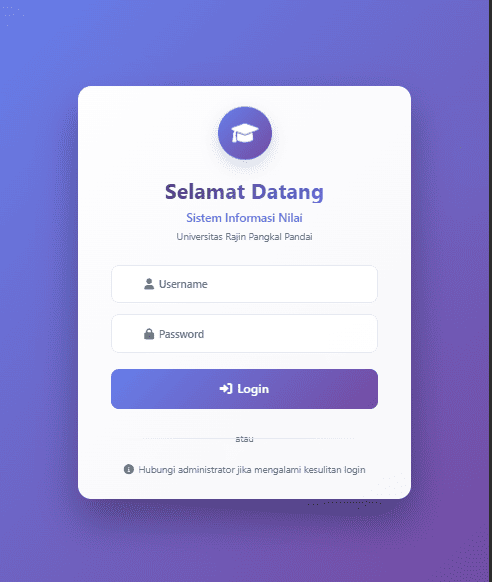 |

### b. Halaman Dashboard

#### - Admin
| Desktop | Mobile |
|--------|--------|
| 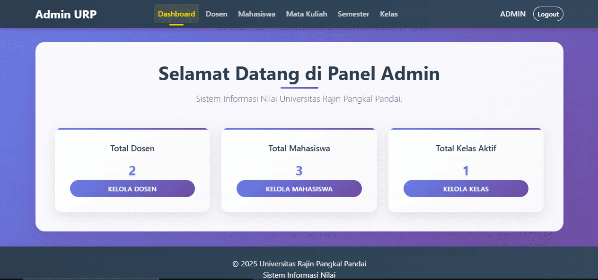 | 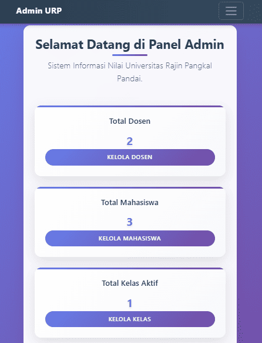 |

#### - Dosen
| Desktop | Mobile |
|--------|--------|
| 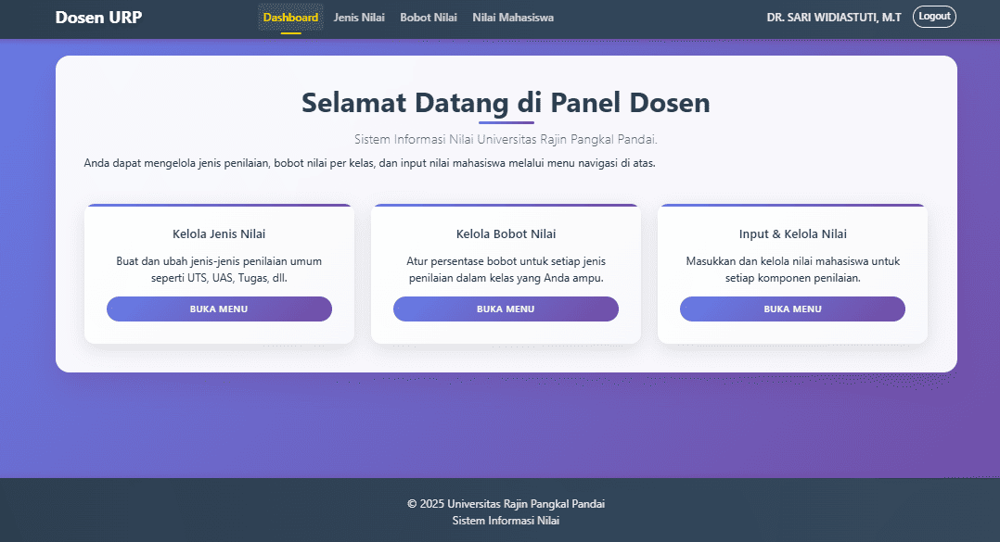 | 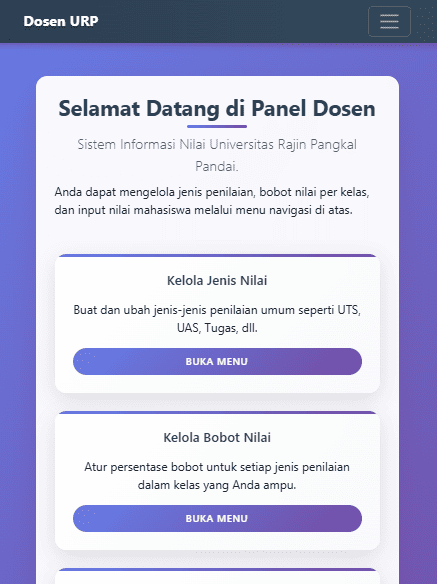 |

#### - Mahasiswa
| Desktop | Mobile |
|--------|--------|
| 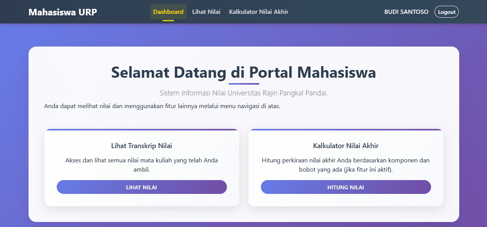 | 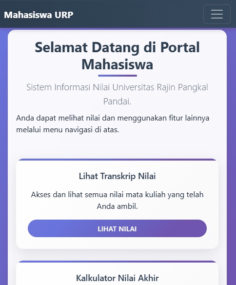 |

---

### c. Fitur-Fitur

#### 1. Bagian Admin

- **Kelola Data Dosen**

  - Tampilan Awal + Hasil Delete  
    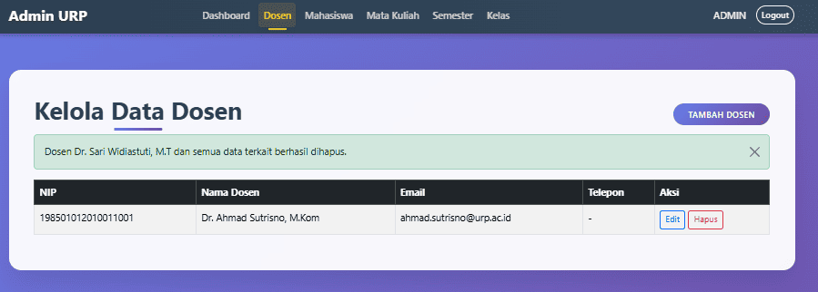

  - Form Edit  
    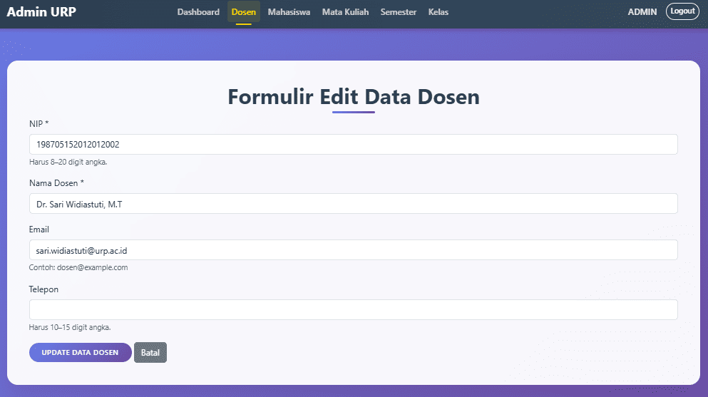

  - Form Tambah  
    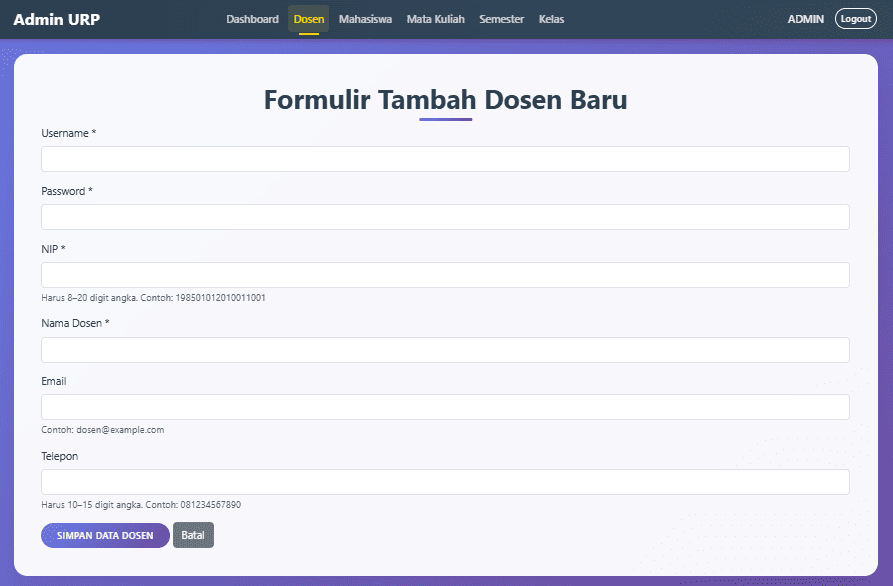

- **Kelola Data Mahasiswa**  
  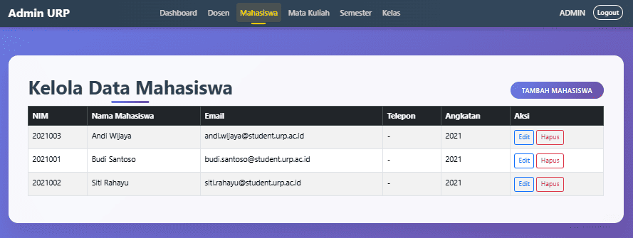

- **Kelola Data Mata Kuliah**  
  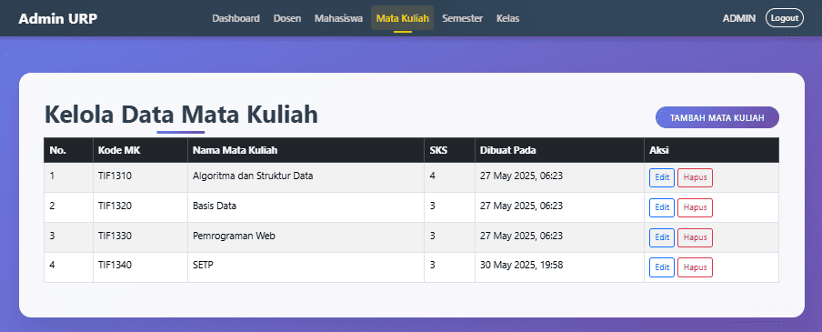

- **Kelola Data Semester**  
  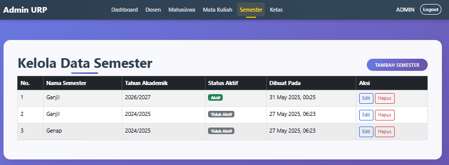

- **Kelola Data Kelas**  
  - Tampilan Awal  
    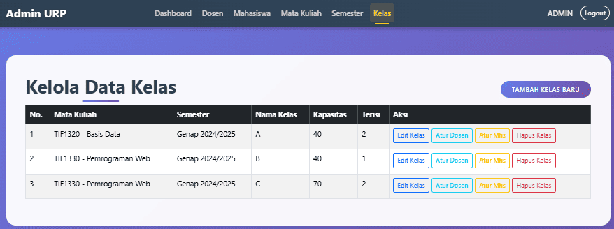

  - Atur Dosen  
    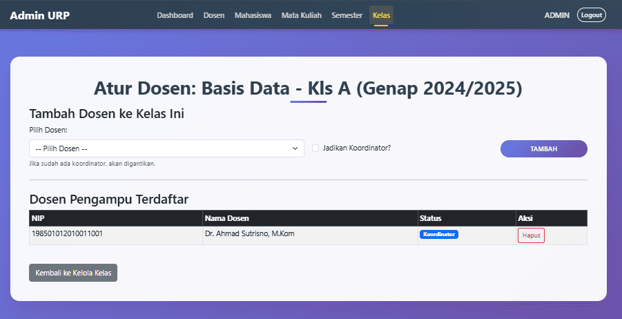

  - Atur Mahasiswa  
    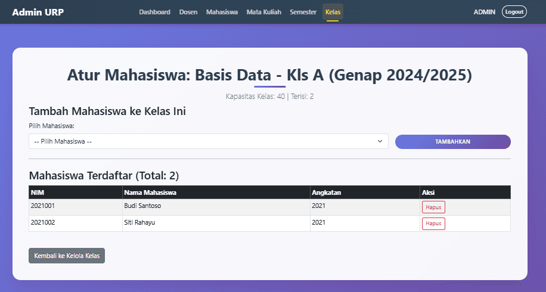

---

#### 2. Bagian Dosen

- **Kelola Jenis Penilaian**  
  - Tampilan Awal  
    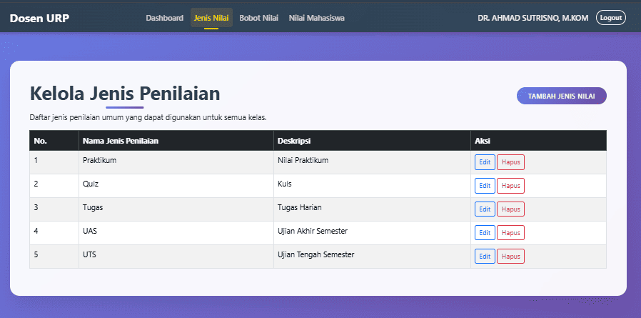

  - Edit Jenis Penilaian  
    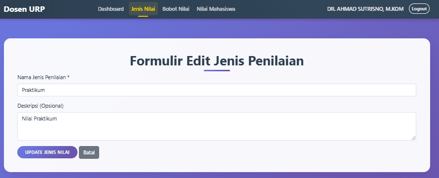

- **Kelola Bobot Nilai**  
  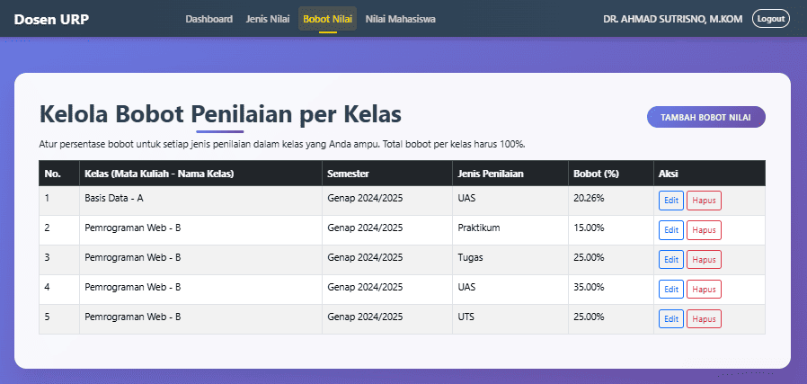

- **Kelola Nilai Mahasiswa**  
  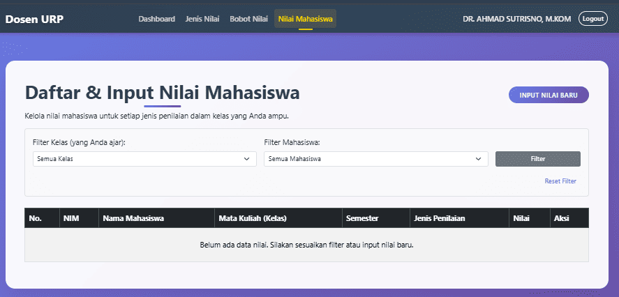

---

#### 3. Bagian Mahasiswa

- **Transkrip Nilai**  
  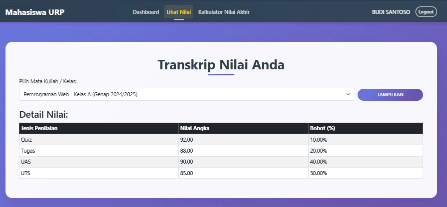

- **Kalkulator Nilai Akhir**  
  

---

## 4. Struktur Folder
```plaintext
pendataanNilai/
├── admin/
│   ├── atur_dosen_kelas.php
│   ├── atur_mahasiswa_kelas.php
│   ├── dashboard.php
│   ├── delete_data_dosen.php
│   ├── delete_data_kelas.php
│   ├── delete_data_mahasiswa.php
│   ├── delete_data_mata_kuliah.php
│   ├── delete_data_semester.php
│   ├── delete_dosen_kelas.php
│   ├── delete_mahasiswa_kelas.php
│   ├── edit_data_dosen.php
│   ├── edit_data_kelas.php
│   ├── edit_data_mahasiswa.php
│   ├── edit_data_mata_kuliah.php
│   ├── edit_data_semester.php
│   ├── kelola_dosen.php
│   ├── kelola_kelas.php
│   ├── kelola_mahasiswa.php
│   ├── kelola_mata_kuliah.php
│   ├── kelola_semester.php
│   ├── tambah_dosen.php
│   ├── tambah_kelas.php
│   ├── tambah_mahasiswa.php
│   ├── tambah_mata_kuliah.php
│   └── tambah_semester.php
├── assets/
│   ├── css/
│   │   └── style.css
│   ├── image/
│   │   └── doc/
│   └── js/
│       └── script.js
├── database/
│   └── urp_nilai.sql
├── dosen/
│   ├── bobot_nilai.php
│   ├── dashboard.php
│   ├── edit_bobot.php
│   ├── edit_jenis_nilai.php
│   ├── edit_nilai.php
│   ├── hapus_bobot.php
│   ├── hapus_jenis_nilai.php
│   ├── hapus_nilai.php
│   ├── jenis_nilai.php
│   ├── nilai_mahasiswa.php
│   ├── tambah_bobot_nilai.php
│   ├── tambah_jenis_nilai.php
│   └── tambah_nilai.php
├── mahasiswa/
│    ├── dashboard.php
│    ├── hitung_nilai_akhir.php
│    └── lihat_nilai.php
├── DOKUMENTASI.md
├── config.php
├── login.php
└── logout.php
```

## 5. Teknologi yang Digunakan
- PHP 
- HTML5 
- CSS (Bootstrap, Font Awesome)
- JavaScript (Bootstrap, Popper)
- phpMyAdmin
- MySQL

## 6. Link Hosting
Website online bisa diakses melalui:  
🔗 [Link 🦅](https:hostingnyamanatangkas)

---

**Disusun oleh:**  
**Anomali Penyuka Taplak Meja**
